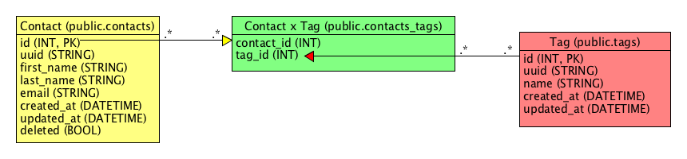
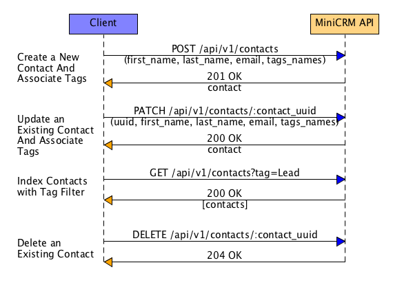
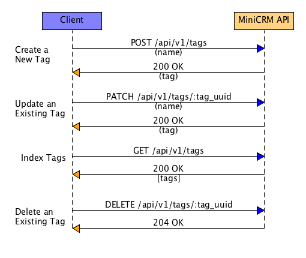

# Mini CRM API

This is a sample project building out a Ruby on Rails backend API for a miniature CRM application.

## Overview

This backend system follows the following practices:
- REST API follows the JSON API Specification, see: https://jsonapi.org/
- UUID fields are used as public identifiers for objects (in API requests/responses ), numeric IDs are only used internally
- Errors are caught in `ApplicationController` and return standardized error messages using an `ErrorMessageBuilderService`
- All endpoints are namespaced to `/api/v1`

### Application Architecture

This project implements the following architecture for handling API Requests:
- Controller receives HTTP request + params
- DataTransferObject (aka DTO) is created to parse the json body params into a PORO to decouple the API interface from the rest of the implementation.
- The DTO is passed to an application Service to perform the required action(s).
- The Services are the only files in the application that touch ActiveRecord to decople from the ORM
- The ActiveRecord model is returned to the Controller and passed to serializer

### Models

#### ERD
Below is an entity-relationship diagram for the database schema.

#### Contacts

- Contacts have a many to many relationship to Tags
- Contacts are soft deleted (see `deleted` bool field)
- Tags can be added or removed from a Contact through the Contact POST & PATCH endpoints.
  - This works by performing find_or_creates by the provided name(s) and then updating the associations accordingly.
- From an API perspective, Tags are an attribute of Contact to simplify API usage.

Below is sequence diagram for basic CRUD on Contacts:

#### Tags

- Tags have a many to many relationship to Contacts
- Tags are hard deleted
- It is impossible to create duplicate tags since all create actions are actually find_or_creates.  This was done to increase referential data integrity and to reduce the amount of duplicate data in the system.

Below is sequence diagram for basic CRUD on Tags:

## Installation

First, if you don't already have it installed, please install Docker following the steps at https://docs.docker.com/install/. You will also need the docker-compose tool which can be installed easily through a package manager such as `brew` with `brew install docker-compose`.

Next, run git clone https://github.com/TPedron/mini-crm.git to clone the repository to your local machine, then continue on to each subsection below.

## Running the Application Using Docker

1. Run `docker-compose build` to build the backend image.
2. Run `docker-compose up -d` to bring the API up, accepting requests at `http://localhost:3001`.
3. Run `CONTAINERID=$(docker ps -qf "name=web"); docker exec -it $CONTAINERID rake db:migrate;docker exec -it $CONTAINERID rake db:setup` to setup the database.

## API Docs

You can generate the API Docs (written using OpenAPI) using the following command:
`npx redoc-cli bundle --cdn -o min-crm-api-docs.html api_docs/openapi.yml`

## Code Quality & Linting

The `Rubocop` gem has been installed. See `.rubocop.yml` for configurations.

Run `rubocop` before merge and fix any linting issues presented.

## Postman

A Postman collection with requests defined for all endpoints can be found in the `/postman` directory along with an environment file.  Please load both and set your environment values for `CONTACT_UUID` and `TAG_UUID` accordingly after creating records with the POST calls.

## Notes

- Things I would have like to have implemented but did not have the time:
  - Pagination on the Contact & Tag index endpoints
  - More filter options on the Contact index endpoint
  - Contact Show endpoint (`/api/v1/contacts/:contact_uuid`)
  - Improve the Postman suite to validate response JSON returned and autoset environment variables.
